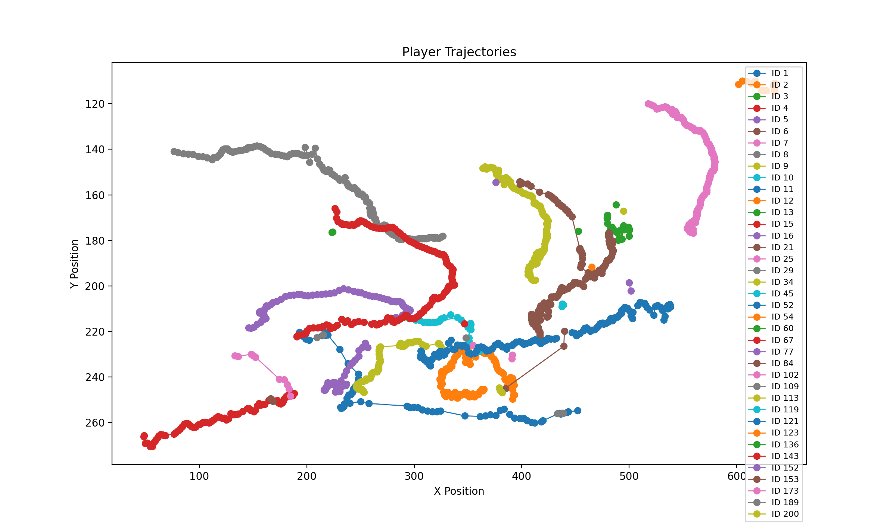
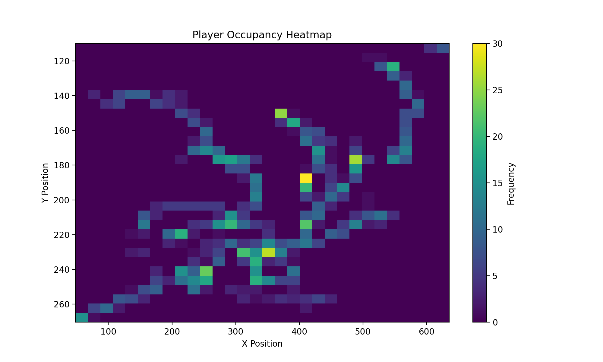
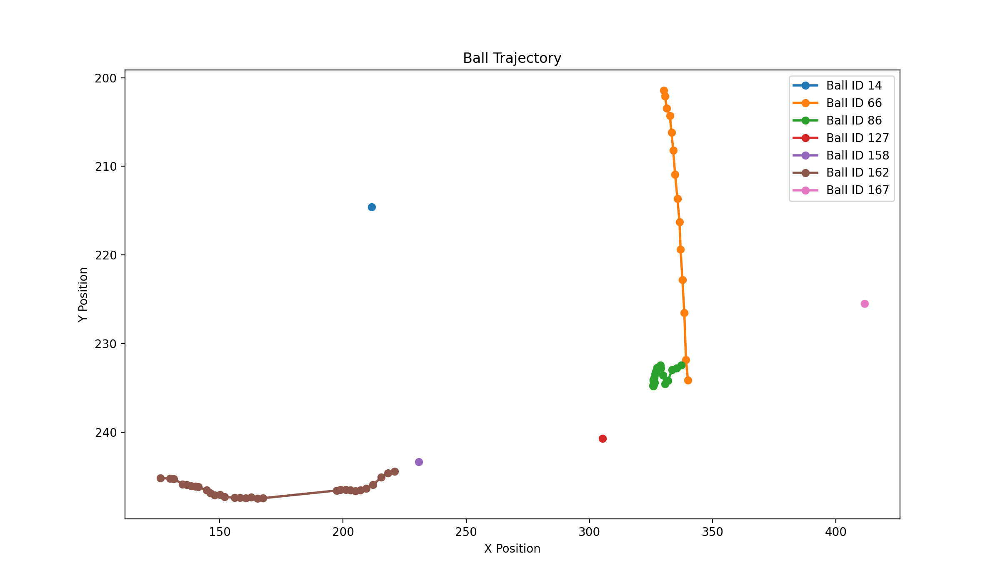

# GameVision AI

GameVision AI is an end-to-end computer vision pipeline for football video analytics. It combines custom YOLOv8 object detection, ByteTrack-based multi-object tracking, structured analytics, visualization, and quantitative evaluation in a reproducible pipeline.

The system detects **players, referees, and the ball** from football match footage, assigns persistent track IDs, exports frame-level tracking data, and generates movement analytics including player trajectories, occupancy heatmaps, ball trajectories, and per-track motion statistics.

---

## Key Results

| Metric | Result |
|---|---:|
| Overall Precision | 91.95% |
| Overall Recall | 83.00% |
| mAP@0.5 | 86.01% |
| mAP@0.5:0.95 | 58.31% |
| Player mAP@0.5 | 99.19% |
| Referee mAP@0.5 | 96.25% |
| Ball mAP@0.5 | 62.59% |
| Effective Throughput | 6.54 FPS |
| Average Latency | 152.95 ms/frame |

Detection metrics were measured on the held-out validation split. Runtime measurements were obtained from the local execution environment and are hardware-dependent.

---

## Features

- Custom YOLOv8-based detection of:
  - Players
  - Referees
  - Ball
- ByteTrack-based multi-object tracking
- Persistent track IDs across video frames
- Structured CSV export of frame-level tracking results
- Player trajectory visualization
- Player occupancy heatmap generation
- Ball trajectory analysis
- Per-track distance and motion statistics in image coordinates
- Detection evaluation with precision, recall, and mAP
- Class-wise performance analysis
- Runtime benchmarking
- Predicted-track continuity and fragmentation analysis
- Automated JSON and Markdown evaluation reports

---

## Pipeline

```text
Input Match Video
        |
        v
YOLOv8 Object Detection
        |
        v
Player / Referee / Ball Detections
        |
        v
ByteTrack Multi-Object Tracking
        |
        v
Frame-Level Tracking CSV
        |
        v
Movement Analytics
        |
        +-------------------+
        |                   |
        v                   v
Trajectory Analysis    Occupancy Heatmaps
        |
        v
Ball Movement Analysis
        |
        v
Evaluation & Reporting
```

---

## Evaluation Methodology

The project is evaluated across three complementary layers.

### 1. Object Detection Evaluation

The trained YOLOv8 detector is evaluated on a held-out validation split containing the three target classes:

- Player
- Referee
- Ball

The evaluation reports:

- Precision
- Recall
- mAP@0.5
- mAP@0.5:0.95
- Class-wise detection performance

### 2. Runtime Benchmarking

Inference performance is measured on a sample match clip using the local execution environment.

Reported measurements include:

- Frames processed
- Total processing time
- Average latency per frame
- Effective throughput in FPS

### 3. Tracking Analysis

Tracking behavior is analyzed from predicted ByteTrack trajectories.

The analysis includes:

- Number of unique track IDs
- Mean temporal coverage
- Median temporal coverage
- Missing frames within track spans
- Longest observed track
- Track-length distribution

These statistics describe the continuity and fragmentation of predicted tracks. They are **not** ground-truth multi-object tracking metrics such as MOTA, HOTA, or IDF1.

---

## Detection Results

### Overall Performance

| Metric | Value |
|---|---:|
| Precision | 0.9195 |
| Recall | 0.8300 |
| mAP@0.5 | 0.8601 |
| mAP@0.5:0.95 | 0.5831 |

### Class-wise Performance

| Class | Precision | Recall | mAP@0.5 | mAP@0.5:0.95 |
|---|---:|---:|---:|---:|
| Player | 0.9712 | 0.9877 | 0.9919 | 0.7469 |
| Referee | 0.9060 | 0.9612 | 0.9625 | 0.7213 |
| Ball | 0.8814 | 0.5410 | 0.6259 | 0.2811 |

### Interpretation

The detector achieves strong performance for players and referees, with both classes exceeding **96% mAP@0.5**.

Player detection achieves **99.19% mAP@0.5** and **98.77% recall**, providing a strong detection foundation for downstream player tracking and trajectory generation.

Ball detection remains the primary challenge. Although ball precision reaches **88.14%**, recall is **54.10%**, indicating missed detections caused by factors such as small object size, motion blur, occlusion, and broadcast-video compression.

---

## Runtime Performance

The runtime benchmark was performed on a 640 × 360 football match clip containing 151 processed frames.

| Metric | Value |
|---|---:|
| Frames Processed | 151 |
| Effective Throughput | 6.54 FPS |
| Average Latency | 152.95 ms/frame |

Runtime measurements depend on hardware, model configuration, image size, and execution environment.

---

## Tracking Analysis

### Predicted Track Temporal Coverage

| Class | Unique Track IDs | Mean Coverage | Median Coverage | Longest Observed Track |
|---|---:|---:|---:|---:|
| Player | 39 | 0.841 | 0.985 | 151 frames |
| Referee | 12 | 0.700 | 0.677 | 145 frames |
| Ball | 7 | 0.941 | 1.000 | 30 frames |

### Interpretation

Player trajectories demonstrate strong temporal continuity, with a median temporal coverage of **98.5%** and a longest observed track spanning the full **151-frame** analyzed clip.

Referee tracks show greater fragmentation, with lower mean temporal coverage of **70.0%**.

Ball tracks have high within-track temporal coverage but are divided across **7 track IDs**, while the longest observed ball track spans only **30 frames**. This indicates that locally continuous ball segments are still affected by missed detections and identity fragmentation across the full clip.

---

## Visual Results

### Player Trajectories



The trajectory visualization displays movement paths of tracked player IDs in image-coordinate space.

### Player Occupancy Heatmap



The occupancy heatmap aggregates player locations across the analyzed clip to visualize frequently occupied image regions.

### Ball Trajectory



The ball trajectory visualization shows detected ball movement segments and highlights fragmentation caused by missed detections and track-ID changes.

---

## Project Structure

```text
GameVisionAI/
│
├── configs/
│   ├── config.yaml
│   └── football_players.yaml
│
├── data/
│   ├── processed/
│   ├── raw/
│   └── sample_videos/
│
├── models/
│   └── gamevision_yolov8s_960.pt
│
├── outputs/
│   ├── metrics/
│   ├── plots/
│   └── videos/
│
├── src/
│   ├── analytics.py
│   ├── analyze_tracks.py
│   ├── benchmark.py
│   ├── detect.py
│   ├── evaluate.py
│   ├── evaluate_tracking.py
│   ├── generate_report.py
│   ├── inspect_dataset.py
│   ├── track.py
│   ├── utils.py
│   └── visualize.py
│
├── main.py
├── run_evaluation.py
├── .gitignore
└── README.md
```

---

## Installation

Clone the repository:

```bash
git clone https://github.com/krishnatejasai/GameVisionAI.git
cd GameVisionAI
```

Create and activate a virtual environment:

```bash
python3 -m venv .venv
source .venv/bin/activate
```

Install dependencies:

```bash
python3 -m pip install -r requirements.txt
```

---

## Usage

### Run the Complete Evaluation Pipeline

```bash
python3 run_evaluation.py
```

### Run the End-to-End Pipeline

```bash
python3 main.py
```

The pipeline performs detection, tracking, structured data export, analytics generation, and visualization.

### Run Detection Evaluation

```bash
python3 src/evaluate.py
```

Output:

```text
outputs/metrics/detection_metrics.json
```

### Run Runtime Benchmark

```bash
python3 src/benchmark.py
```

Output:

```text
outputs/metrics/runtime_benchmark.json
```

### Run Tracking Continuity Analysis

```bash
python3 src/evaluate_tracking.py
```

Output:

```text
outputs/metrics/tracking_continuity_metrics.json
```

### Run Track Fragmentation Analysis

```bash
python3 src/analyze_tracks.py
```

Output:

```text
outputs/metrics/track_fragmentation_metrics.json
```

### Generate Consolidated Evaluation Report

```bash
python3 src/generate_report.py
```

Outputs:

```text
outputs/metrics/evaluation_summary.json
outputs/metrics/evaluation_summary.md
```

---

## Generated Analytics

The analytics pipeline generates:

- Player trajectories
- Player occupancy heatmaps
- Ball movement paths
- Per-track movement statistics
- Detection evaluation metrics
- Runtime benchmark reports
- Track continuity statistics
- Track fragmentation analysis
- Consolidated evaluation reports

---

## Limitations

- Ball detection remains challenging because of small object size, motion blur, occlusion, and video compression.
- Tracking continuity statistics are computed from predicted trajectories rather than ground-truth MOT annotations.
- Runtime results are hardware-dependent.
- Movement distances and speeds are measured in image-coordinate space.
- Camera motion and perspective changes affect image-coordinate movement statistics.
- The current pipeline does not perform pitch calibration or homography-based conversion to real-world field coordinates.

---

## Future Improvements

Potential extensions include:

- Pitch detection and homography estimation
- Transformation from image coordinates to field coordinates
- Real-world distance and speed estimation
- Team classification using jersey appearance
- Ball trajectory interpolation during short detection gaps
- Stronger small-object detection strategies for the ball
- Ground-truth MOT evaluation with MOTA, HOTA, and IDF1
- Tactical formation and spatial-control analysis

---

## Tech Stack

- Python
- PyTorch
- Ultralytics YOLOv8
- ByteTrack
- OpenCV
- Pandas
- NumPy
- Matplotlib

---

## Evaluation Artifacts

Machine-readable and human-readable evaluation reports are available under:

```text
outputs/metrics/
```

The consolidated reports are:

```text
evaluation_summary.json
evaluation_summary.md
```

These reports combine detection performance, runtime measurements, and descriptive tracking statistics into a single evaluation artifact.

---

## Author

**Sai Sri Krishna Teja Sanku**

M.S. in Computer Science
University of Florida